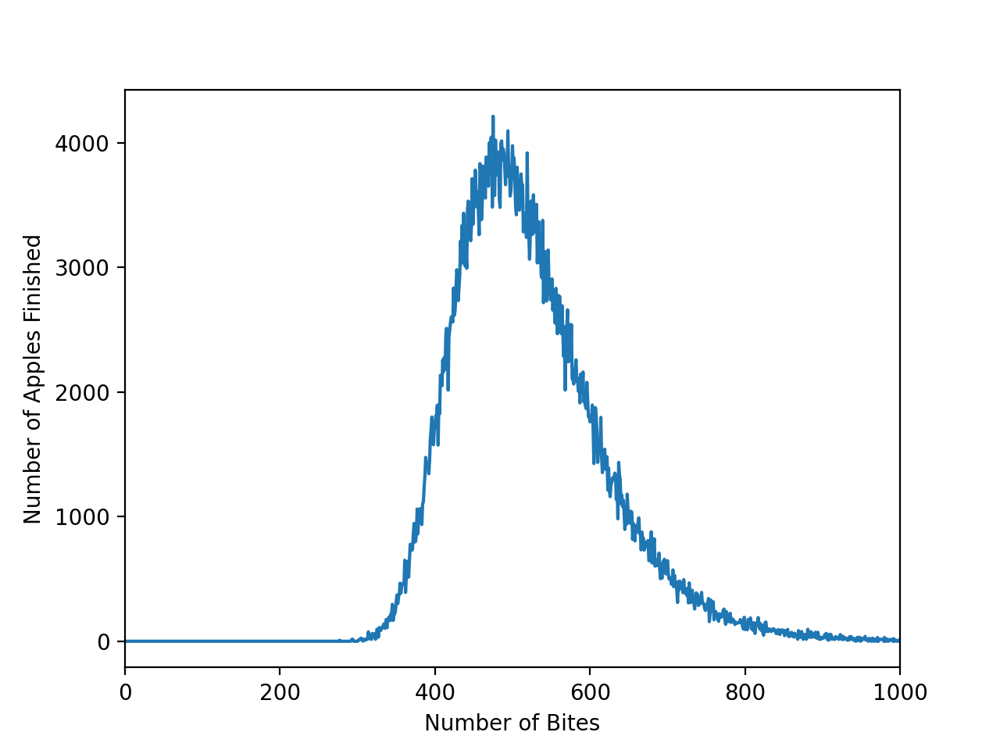

## How many bites to eat the apple?

First we want to figure out the area that a bite will take up. We can do this by just integrating over the surface of a sphere

where R is the radius of the apple. This gives

where r is the radius of the bite. If you Taylor expand the cosine you can see that as R tends to infinity, we recover the area of a circle of radius r, since the since the Apple becomes a plane.

We can find out the probability of a given piece of the apple being bitten in a bite by dividing this through by the surface area of the apple

Which for an apple radius of 4cm and a bite radius of 1cm, gives 0.016.

If we frame this in terms of "How many bites does a place on the apple expect to have" we can make this a Poisson problem. 

Is the expected # of bites in a place on the sphere after 1 bite. Unfortunately you can't extend this to "What is the expected number of bites until there are no unbitten regions left. So we turn to computers.

## Numerical Solution

We will do this numerically via a monte carlo method. First we will generate many random points on a sphere, then randomly take bites out of it, removing these points from our list until we have none left. If we do this many times we can get an approximate expectation value. 

We have to make sure we calculate distances the correct way, and also sample correctly. The distances are calculated using the [Haversine formula](https://en.wikipedia.org/wiki/Haversine_formula). Numerically we use the difference of angles formula to break this apart, so we are able to pre-compute all the trig functions for our monte carlo points. 

I wrote this up in C++ which wound up being absurdely over engineered. It's very fast. Simulating 800000 apples (on one Apple Macbook) yields a distribution which looks like this.

We can see individual bites removing points in this video:

The expectation value of this distribution is 521.92
